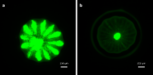

# Contrasting Larval Phenotypes in the Reef-Building Coral Stylophora pistillata Suggest a Diversified Bet-Hedging Strategy

Authors: Liel Uziahu, Elizaveta Skalon, Miri Morgulis, Noam Gazit, Zoe Diemers, Maya Ben-David, Amit Zeltzer, and Tali Mass.

Environmental variability may favor the production of offspring with contrasting phenotypes, yet the role of such variation in coral persistence remains poorly understood. We compared planulae at the high- and low-fluorescence extremes of the phenotypic range in the stony coral Stylophora pistillata. High-fluorescence (HF) and non-fluorescence (NF) planulae harbored similar Symbiodiniaceae communities but differed in morphology, physiology, tissue organization, and host gene expression. HF planulae were larger, exhibited elevated green fluorescent protein intensity, and had lower baseline respiration. NF planulae had a thicker ectoderm and a higher putative lipid-utilization index. HF larvae showed higher expression of GFP-like and biomineralization-associated genes, whereas NF larvae were associated with pathways related to environmental sensing and cellular stress regulation. We then compared settlement and early post-settlement physiology in separate temperature, pH, and light experiments. HF larvae settled at a higher proportion than NF larvae in six of the seven conditions, although no individual treatment comparison was significant. In the axis-specific models, phenotype affected settlement only within the pH experiment. Post-settlement respiration showed a phenotype-by-condition interaction only within the pH experiment, whereas differences under high temperature and low light were supported only by uncorrected treatment-level comparisons. The functional absorption cross-section of Photosystem II was higher in HF-derived polyps across all three experimental axes, whereas maximum quantum yield (Fv/Fm) did not differ between phenotypes. Symbiont density remained similar throughout. These findings identify intracolonial larval variation associated primarily with host traits, some of which persisted through early settlement. This variation may provide the phenotypic basis for diversified bet-hedging, although its fitness consequences across variable environments and later life stages remain to be determined.

